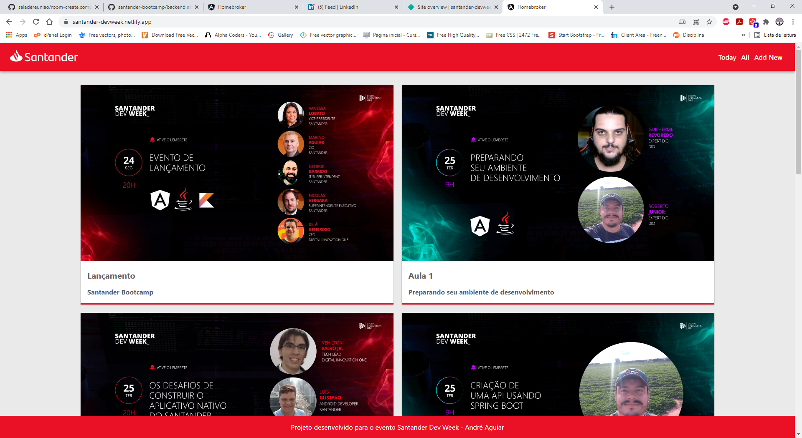
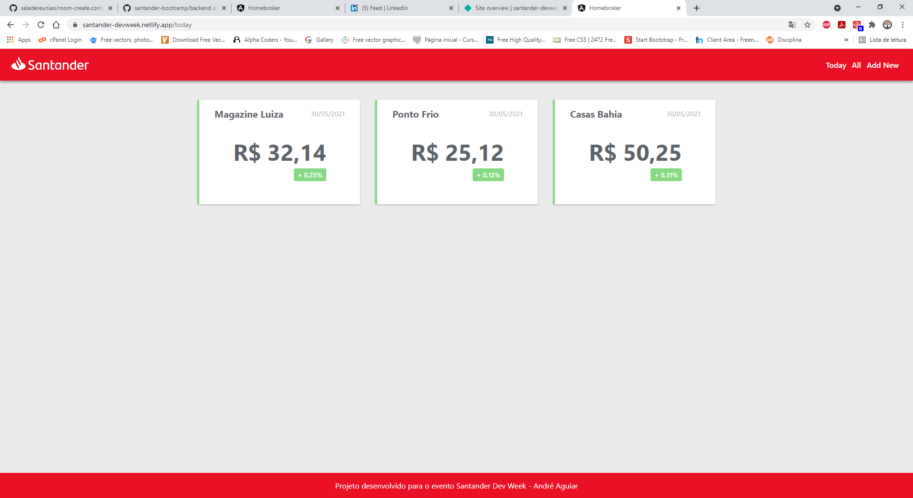
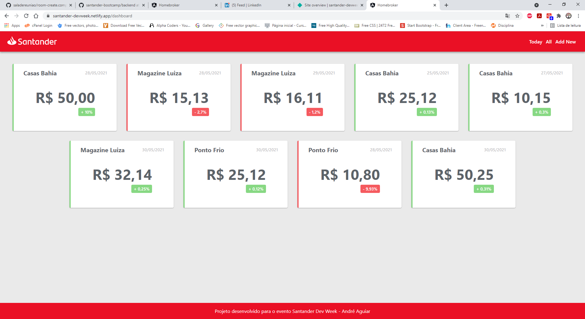
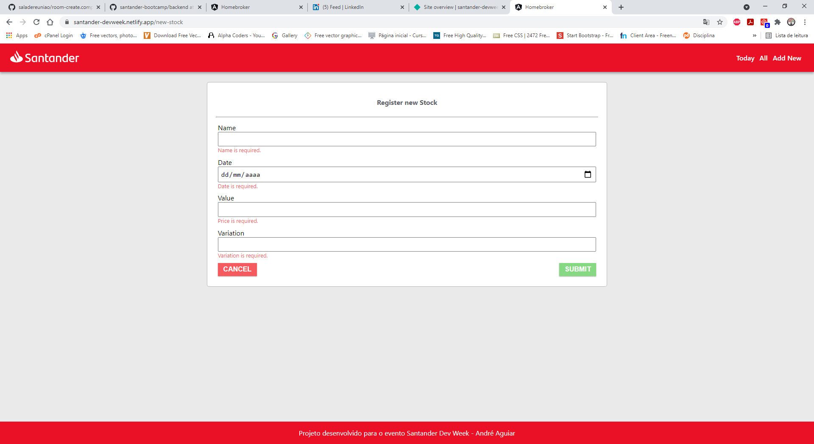
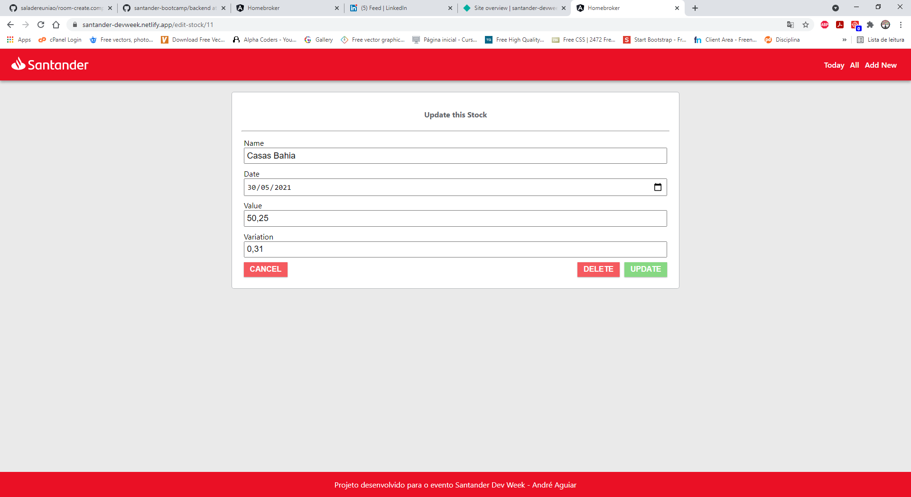

# Santander Dev Week

## [Bootcamp DIO](https://digitalinnovation.one/sign-up?ref=NL9EADWVZW)

Semana de muito aprendizado e mão na massa!

Full Stack: Angular e Java do zero ao deploy.

[Projeto final](https://santander-devweek.netlify.app/): Backend no Heroku com Java e PostgreSQL | Frontend no Netlify com Angular.

